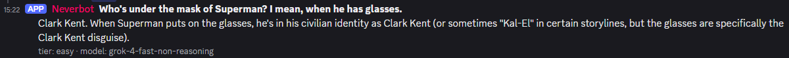

# Discord Bot + FastAPI Proxy for 1min.ai

A self-hosted Discord bot that gives a Discord server access to [1min.ai](https://1min.ai) (a multi-model AI
subscription — GPT, Claude, Gemini, etc. under one API), through a small FastAPI proxy that holds the API key
server-side.

The bot never sees the 1min.ai API key; the proxy never sees the Discord token. They only share a secret
header to authenticate to each other.

## What it uses

- **Python 3.12**
- **FastAPI** + **httpx** — the proxy that talks to 1min.ai
- **discord.py** — the Discord bot
- **Docker Compose** — runs both services as containers on one host

## What it does

- `/ask question:<text> web_search:<True/False>` → the bot replies directly in the channel (shown as a reply
  to the `/ask` invocation) with the question and the answer; `web_search` is optional (defaults to off) and
  lets the model ground its answer with live web results
- Each question is auto-classified (via a single cheap model call) along two axes — **category**
  (code/IT → Anthropic, factual/knowledge → OpenAI, general/casual → xAI) and **difficulty**
  (easy / medium / hard) — and routed to the matching model; see `MODELS.md` for the full matrix
- The reply shows the question in bold, the answer, and a small `-#` subtext footer with the category, tier,
  and model used
- Short replies (≤1000 chars) post directly in the channel, split across multiple messages if needed, and are
  single-shot with no follow-up memory; longer replies get their own thread instead, and any message posted
  in that thread afterward continues the same 1min.ai conversation (multi-turn context, no `/ask` needed)
- Optional `ALLOWED_GUILD_IDS` env var restricts which Discord servers the bot responds in
- `/ask` only works inside a server, never in a DM to the bot — otherwise anyone who can message the bot
  directly could burn through your 1min.ai credits without being in any of your servers



See `documentation.html` for the full architecture, the 1min.ai API reference used, and a Proxmox LXC
deployment guide. See `MODELS.md` for the full list of 1min.ai model identifiers, parsed from
[1min.ai's Chat with AI API docs](https://docs.1min.ai/docs/api/chat-with-ai-api) — worth re-checking that
page occasionally, since 1min.ai adds new models regularly.

## Clone and run

```bash
git clone https://github.com/Revanito/discord-1min-proxy discord-1min-proxy
cd discord-1min-proxy
cp .env.example .env
nano .env   # fill in the values below
docker compose up -d --build
docker compose logs -f
```

## Configuring `.env`

| Variable | Required | What to put |
|---|---|---|
| `ONE_MIN_API_KEY` | Yes | Your 1min.ai API key (from your 1min.ai account/API settings) |
| `PROXY_SHARED_SECRET` | Yes | Any long random string you make up — it's just a shared password between the bot and the proxy, not sent to 1min.ai |
| `MODEL_CODE_EASY`<br>`MODEL_CODE_MEDIUM`<br>`MODEL_CODE_HARD` | No | Models used for programming/IT questions, per difficulty tier (Anthropic by default) |
| `MODEL_GENERAL_EASY`<br>`MODEL_GENERAL_MEDIUM`<br>`MODEL_GENERAL_HARD` | No | Models used for casual/general questions, per difficulty tier (xAI by default) |
| `MODEL_SPECIFIC_EASY`<br>`MODEL_SPECIFIC_MEDIUM`<br>`MODEL_SPECIFIC_HARD` | No | Models used for factual/knowledge questions, per difficulty tier (OpenAI by default) |
| `MODEL_CLASSIFIER` | No | Cheap/fast model used to classify category + difficulty before routing, e.g. `gpt-4o-mini` |
| `DISCORD_BOT_TOKEN` | Yes | From the [Discord Developer Portal](https://discord.com/developers/applications) → your application → Bot → Token |
| `ALLOWED_GUILD_IDS` | No | Comma-separated Discord server IDs to restrict the bot to; leave empty to allow any server it's invited to |
| `DEV_GUILD_ID` | No | Your test server's ID, for instant slash-command sync while developing (global sync can take ~1 hour) |

<sub>Full list of valid model identifiers in `MODELS.md`, parsed from
[docs.1min.ai/docs/api/chat-with-ai-api](https://docs.1min.ai/docs/api/chat-with-ai-api).</sub>

Discord bot setup notes:
- Invite the bot with at least the `Send Messages`, `Create Public Threads`, `Send Messages in Threads`, and
  `Use Application Commands` permissions (thread permissions are needed for replies over 1000 characters).
- Enable the **Message Content Intent** for the bot in the
  [Discord Developer Portal](https://discord.com/developers/applications) → your application → Bot →
  Privileged Gateway Intents. This is required so the bot can read follow-up messages posted inside an
  answer thread and continue the conversation; without it the bot will fail to log in. It's the only
  privileged intent needed — the bot doesn't read message content anywhere outside of its own answer threads.

## Troubleshooting: "The application did not respond" in Discord

Discord requires the bot to acknowledge a slash command within 3 seconds, or it invalidates the interaction
(the bot's reply then fails with a `404 Unknown interaction` in the logs, and Discord shows "The application
did not respond" until you retry). If this happens consistently, it's almost always slow DNS resolution
inside the container rather than an actual code/network problem — check with:

```bash
docker compose exec bot python3 -c "import socket,time; t=time.time(); socket.getaddrinfo('discord.com',443,socket.AF_INET); print(time.time()-t)"
```

If that takes multiple seconds instead of milliseconds, Docker's embedded DNS (`127.0.0.11`) is likely falling
back through a slow or unreachable upstream resolver (e.g. a local router/host resolver on an LXC/VM) before
reaching a working one. `docker-compose.yml` already pins both services to `1.1.1.1` and `8.8.8.8` via the
`dns:` key to avoid this — if you still see slow lookups after pulling the latest version, confirm that
`dns:` block is present and rebuild (`docker compose up -d --build`).

## Stopping / updating

```bash
docker compose down          # stop
git pull && docker compose up -d --build   # update to latest code
```

The proxy creates a fresh 1min.ai conversation per `/ask` call (keyed by the Discord interaction id) and
persists that mapping in a Docker volume. For threaded answers, the bot separately persists a
Discord-thread-id → interaction-id mapping in its own volume, so it knows which 1min.ai conversation to
continue when a follow-up message arrives in that thread — both mappings survive container restarts.